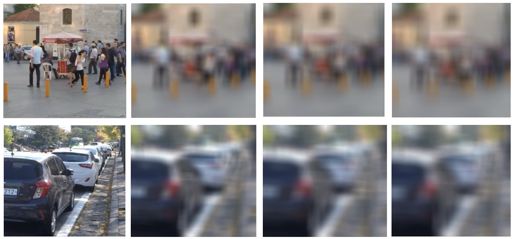
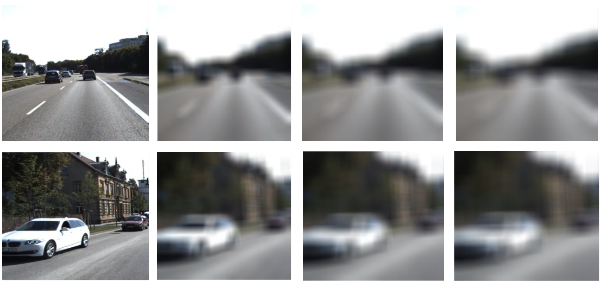

# X-DECODE: EXtreme Deblurring with Curriculum Optimization and Domain Equalization

## Evaluation - Train/Test on Extreme-GOPRO::


| BL | Metric | DeblurGAN | DeblurGANv2 | NAFNet | Ours |
|----|--------|-----------|-------------|--------|------|
| 19 | SSIM | 0.282 | 0.668 | 0.642 | **0.764** |
|  | PSNR | 19.51 | 23.94 | 22.99 | **24.90** |
| 25 | SSIM | 0.258 | 0.635 | 0.577 | **0.674** |
|  | PSNR | 19.09 | 22.88 | 21.50 | **23.64** |
| 29 | SSIM | 0.240 | **0.618** | 0.545 | 0.613 |
|  | PSNR | 18.84 | 22.33 | 20.76 | **22.68** |

## Evaluation - Train on EXTREME-GOPRO and Test on EXTREME-KITTI:


| Method | SSIM | PSNR |
|--------|------|------|
| DeblurGAN [5] | 0.256 | 16.24 |
| DeblurGANv2 [6] | 0.466 | 18.45 |
| NAFNet [8] | 0.428 | 18.18 |
| Ours (Without CL) | 0.386 | 18.15 |
| **Ours (With CL)** | **0.549** | **20.71** |


## Training and Testing on Extreme GoPRO Dataset

First install all requirements:
```bash
pip install -r requirements.txt
```

To train the model on the Extreme GoPRO dataset, use the following command:

```bash
python TrainTestSameDomainGoPro/main.py --dataset="<dataset_name>"
```

To test the model:

```bash
python TrainTestSameDomainGoPro/test.py
```

## Training on Extreme Cityscapes and PascalVOC, Testing on KITTI Dataset 

* Supported dataset options: `Cityscapes`, `GoPRO`, `PascalVOC`. 
* Use this to train the model using different curriculum learning strategies:

```bash
python TrainTestOnDiffDomain/main.py --dataset="dataset_dir/" --curr_lear="<curriculum_type>"
```

Supported values for `--curr_lear`:
- `linear` : Linear curriculum learning
- `stepwise` : Step-wise curriculum learning
- `slow-stepwise` : Slower step-wise curriculum learning
- `expo` : Exponential curriculum learning
- `sigmoid` : Sigmoid-based curriculum learning
- `none` : Training without curriculum learning

* Supported datasets: `Cityscapes`, `GoPRO`, `PascalVOC`.

To test the model:

```bash
python TrainTestOnDiffDomain/test_new_range_of_blur.py --dataset_dir="dataset_dir/" --model_dir="model_dir/"
```
It also generates a `CSV` file containing the computed SSIM and PSNR for each image pair and the final mean SSIM and PNSR.


## Dataset

The following datasets were used for training and evaluation:

| Dataset        | Purpose                | Description |
|---------------|------------------------|-------------|
| GoPRO         | Primary training & evaluation | Each blurred image has a corresponding sharp image. Extreme motion blur levels (BL19 to BL29) are simulated using the Albumentations library. |
| PascalVOC-2012 | Cross-domain training   | Standard object recognition dataset adapted for deblurring experiments. |
| Cityscapes    | Cross-domain training   | Urban street scene dataset adapted for deblurring tasks. |
| KITTI         | Cross-domain testing    | Major test dataset for evaluating performance across domains. |

### Sample Images

Extreme-GoPRO - Samples (First column sharp image and rest others is obtained after applying Blur Level 19, 25 and 29):


KITTI - Samples (First column sharp image and rest others is obtained after applying Blur Level 19, 25 and 29):


### Dataset Download Links

| Dataset        | Download Link |
|---------------|--------------|
| Extrene GoPRO        | [Download](https://drive.google.com/file/d/1bPmWjU6cdGK0-1jPZE4V0C2g_gFdH9wb/view?usp=sharing) |
| Extreme PascalVOC-2012 | [Download](https://drive.google.com/file/d/1C9zi-97ot5Gl5JQlBoloDkpizVUcvFiu/view?usp=sharing) |
| Extreme Cityscapes  | [Download](https://drive.google.com/file/d/1bSfGpCjh2GfgWSzabRMTpKDtPcXGg6qo/view?usp=sharing) |
| Extreme KITTI         | [Download](https://drive.google.com/file/d/134O-eIaT_oyWr9WEnOYk77uQI4h7-D4a/view?usp=sharing) |

## Pretrained Models

Pretrained models for different datasets:

| Trained on | Learning type | Download Link |
|-------------------|--------------------|---------------|
| GoPRO extreme Blurred | Step-wise (Train/Test on GoPRO)| [Download](https://drive.google.com/file/d/1Flysoyhl-0MVY3TDwMGoqoZd-jisD_LS/view?usp=sharing) |
| GoPRO extreme Blurred | Linear Curriculum Learning (Test on KITTI) | [Download](https://drive.google.com/file/d/1bEmRqsOsXlhrJO-nqStzP_iJ37qts5I2/view?usp=sharing) |
| Cityscapes extreme Blurred | Linear Curriculum Learning (for KITTI testing) | [Download](https://drive.google.com/file/d/1ebHSmETkhCDdoxFQtHZMuPbX2BFEkFkW/view?usp=sharing) |
| Pascal VOC extreme Blurred | Linear Curriculum Learning (for KITTI testing) | [Download](https://drive.google.com/file/d/1-r-_rVNsLh7G2ImBV7gXrv4IKaZF51Of/view?usp=sharing) |

Pretrained models for different curriculum learning. All Tested on Kitti Dataset:

| Model Description | Curriculum Learning | Download Link |
|-------------------|--------------------|---------------|  
| Cityscapes Extreme Blurred  | Step-wise | [Download](https://drive.google.com/file/d/1zCHXNQD5qQKDxMXbb1DstexTA9Ut-4jv/view?usp=sharing) | 
| Cityscapes Extreme Blurred | Slower Step-wise | [Download](https://drive.google.com/file/d/1NP7nd5J4B_ONb-qU8TsZn-9CIc6PycWv/view?usp=sharing) |
| Cityscapes Extreme Blurred  | Linear | [Download](https://drive.google.com/file/d/1VDl_uxY_TovasentsW6gvk_leCFHDoME/view?usp=sharing) |
| Cityscapes Extreme Blurred  | Exponential | [Download](https://drive.google.com/file/d/1Uw-OESdHbfupCZOmG3lvkT8N6ZKuBpLQ/view?usp=sharing) |
| Cityscapes Extreme Blurred  | Sigmoid | [Download](https://drive.google.com/file/d/10zsAbsVozEd9tJsaH1Yj3lLxTWXCa9gi/view?usp=sharing) |


### Comparison of Curriculum Learning Techniques on Extreme-KITTI Dataset, Trained on Extrem-Cityscapes Dataset Results

| Curriculum Learning Method | SSIM | PSNR |
|----------------------------|------|------|
| Step-wise | 0.619 | 21.97 |
| Slower Step-wise | 0.468 | 18.91 |
| **Linear** | **0.628** | **22.20** |
| Sigmoid | 0.405 | 18.02 |
| Exponential | 0.614 | 21.79 |

## References

- [pix2pix-pytorch](https://github.com/mrzhu-cool/pix2pix-pytorch)